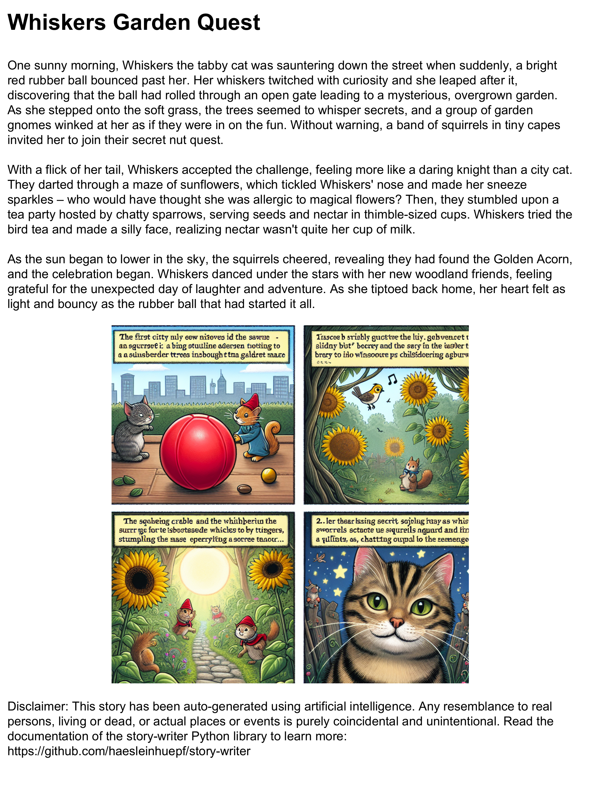
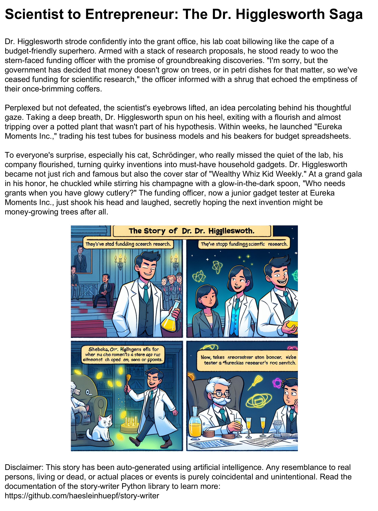

# Story writer

A AI-based story writer Python library which uses OpenAI's [chatGPT](https://chat.openai.com/) and [Dall-E](https://openai.com/dall-e-2) to generate PDFs with a story and a picture from a prompt and writes them into a PDF.




## Usage

There is a high-level API available, which generates PDFs from prompts (e.g. the stories presented in the teaser above were produced using [this notebook](https://github.com/haesleinhuepf/story-writer/blob/main/docs/demo.ipynb)):

```python
from story_writer import generate_story
generate_story("cat_story.pdf", "a story about a cat that is walking on a street")
```

And there is a low-level API available, which generates a story and an image separately. 
You can learn more about the low-level API in [this notebook](https://github.com/haesleinhuepf/story-writer/blob/main/docs/story_building.ipynb).

## Installation

You can install story-writer using pip:

```commandline
pip install story-writer
```

You also need to create an OpenAI API Key and add it to your environment variables as explained on [this page](https://help.openai.com/en/articles/5112595-best-practices-for-api-key-safety).

## Development

If you want to contribute to `bia-bob`, you can install it in development mode like this:

```
git clone https://github.com/haesleinhuepf/story-writer.git
cd story-writer
pip install -e .
```

## Similar projects

* [Storyteller-core](https://github.com/jaketae/storyteller)

## Feedback welcome!

The `story-writer` is developed in the open because we believe in the open source community. Feel free to drop feedback as [github issue](https://github.com/haesleinhuepf/story-write/issues). Contributions are very welcome. 

## License

Distributed under the terms of the [BSD-3] license,
"story-writer" is free and open source software

[BSD-3]: http://opensource.org/licenses/BSD-3-Clause

## Acknowledgements

